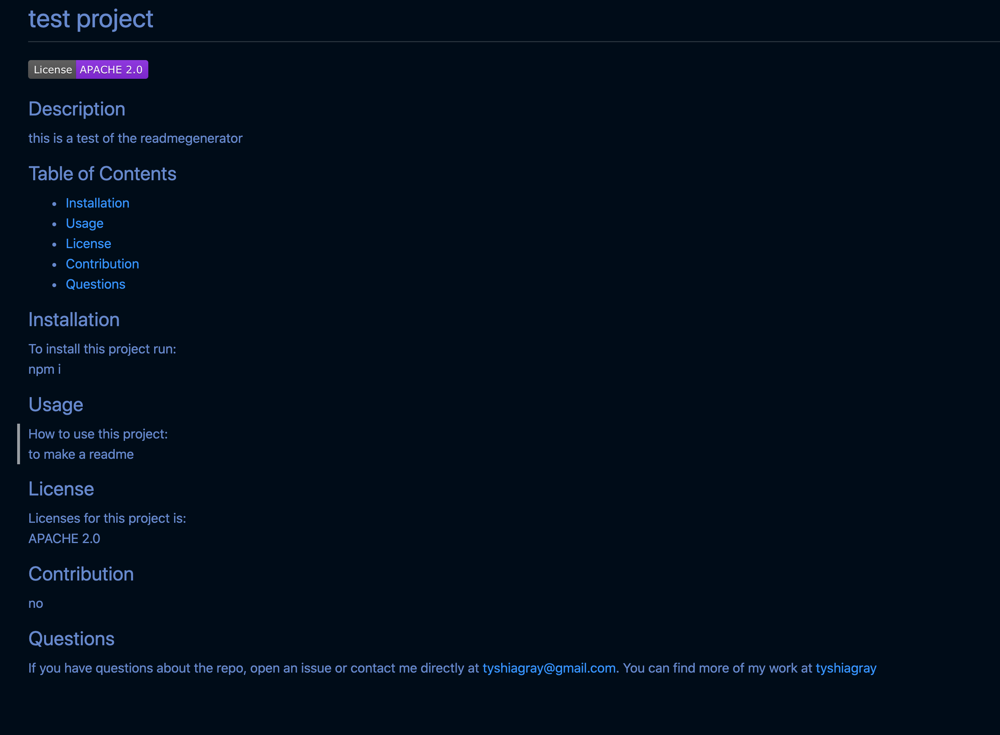

# readMe-Generator  
  
## Description  
This project was to learn about using node and to build an app that creates readMe
  
## Table of Contents  
* [Installation](#installation)  
* [Usage](#usage) 
* [License](#license)
* [Contribution](#contribution)  
* [Image](#image)
* [Questions](#questions)
  
## Installation  
To install this project run:  
npm i  
  
## Usage  
How to use this project:  
you run node index.js 

## License
Licenses for this project is:    
MIT

## Contribution
no contribution at this time  

## Image  

  
## Questions  
If you have questions about the repo, open an issue or contact me directly at tyshiagray@gmail.com. You can find more of my work at [tyshiagray](https://github.com/tyshiagray/)
